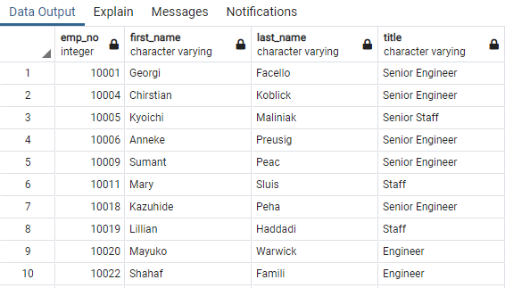
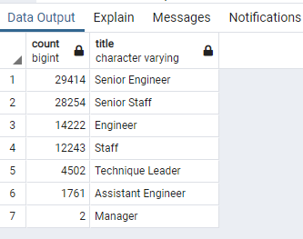
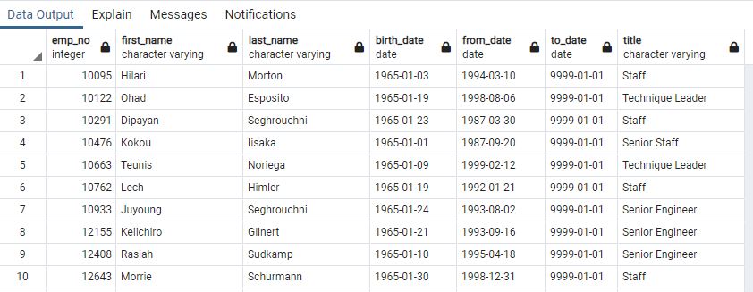

# ***Pewlett-Hackard-Analysis***

## **Project Overview**
We are using SQL to identify the employees who are eligible to participate in a mentorship progeam. Once we have this data identified we will write a report that summarizes the analysis to help the manager prepare for the "silver tsunami" as many current employees reach retirement age.

## **Results**
- Pewlett-Hackard needs to prepare and plan ahead for a "silver tsunami". Many of its current employees are eligible for retirement. Therefore we prepared a table were we have the number of employees retiring by their title.

- When analyzing this data, we realize that there are 90,398 employees that are eligible for retirement. In order to plpan ahead, we need to know how many employees are eligible for retirement by title.

- One way that Pewlett-Hackard can prepare for the "silver tsunami", is by having a mentoring program helping promote employees withnin the company. By filtering the data current employees whose birth date is in the year 1965.

- After analyzing this data, we realize that we have 1,549 employees who can be mentors for new employees or current employees seeking a new position in the company.

## **Summary**
By analyzing the data we can establish that Pewlett-Hackard will need to hire 90,398 new employees in order to fullfill the "silver tsunami"

